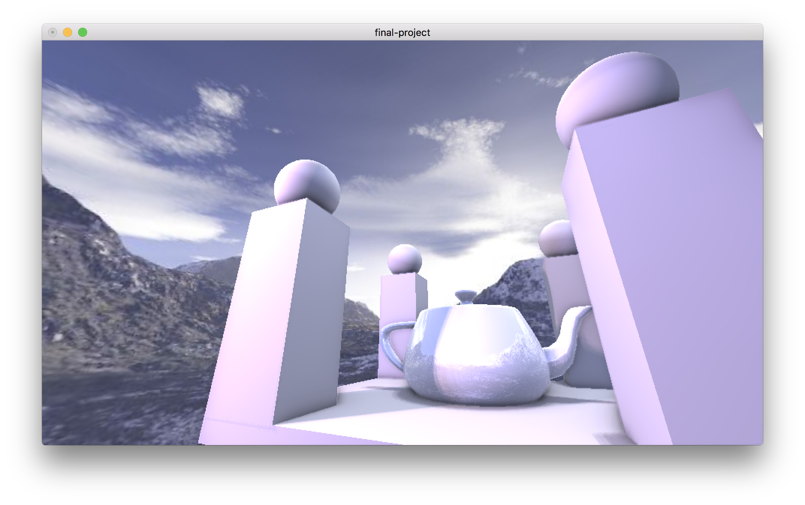

# CSE 163 Project 3: Basic High Quality Real Time Rendering

## Author

- Ziyang Li A92070182
- Yunlu Huang A91008991

## Website

Full Documentation, Compile Instructions, Functionality Write-up:

[http://cubes.studio/cse163/proj3/index.html](http:://cubes.studio/cse163/proj3/index.html)

## Overview

In this Project 3, we are implementing a high quality real time rendering
enging using OpenGl and GLSL shader language. The first part we implement
is the scene loader, mesh loader and the FPS like control system, which
require us to write a generalized <code>.obj</code> file loader that can
handle multiple object loading in the same file. For our shadow and
lighting, we implemented both direct light which will generate
2d shadow map and point light which will generate cube shadow map.
We also implemented SSAO (screen-based
ambient occlusion) to assist the shadowing to make the scene look more
realistic. For the environment map, we have implemented both normal environment
map and irradiance environment map, which can not only give the scene a
environment but can also contribute to the reflection and diffuse lighting
of the scene.

